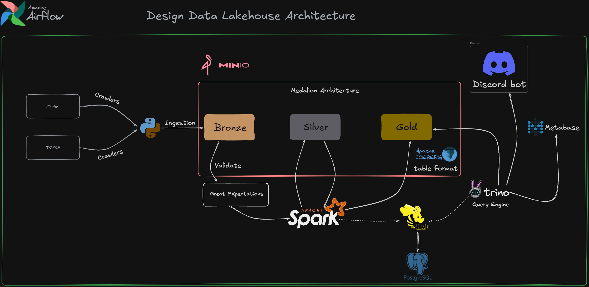
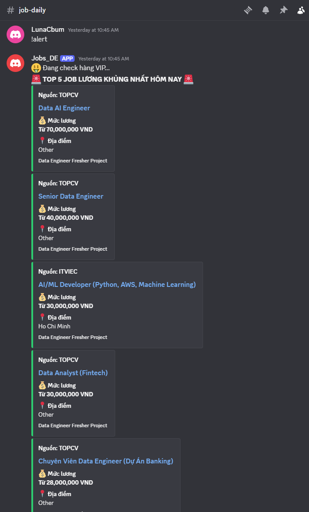
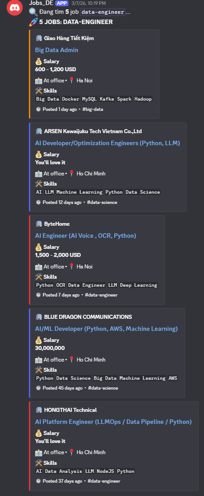
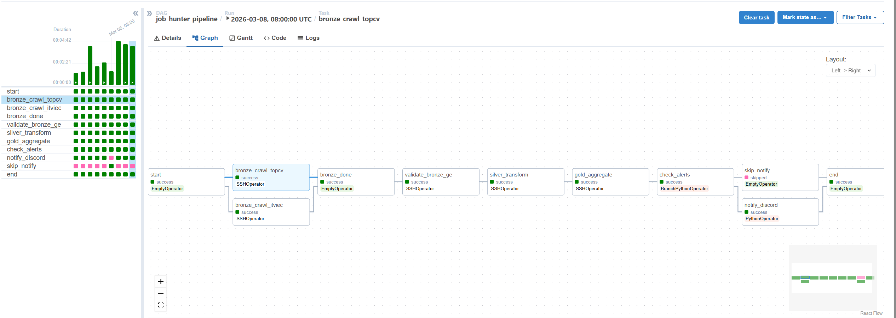
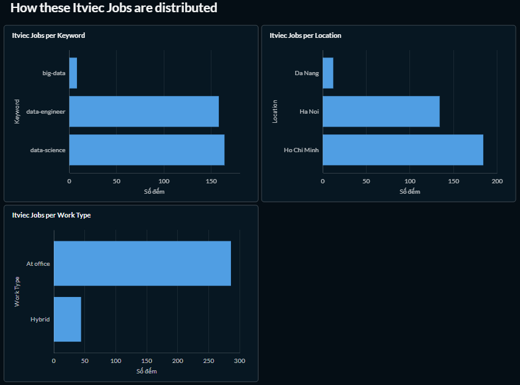
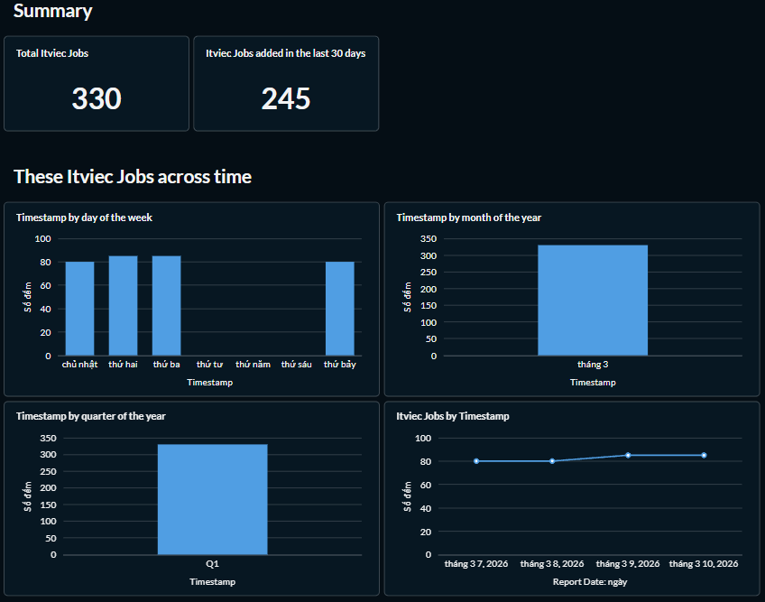
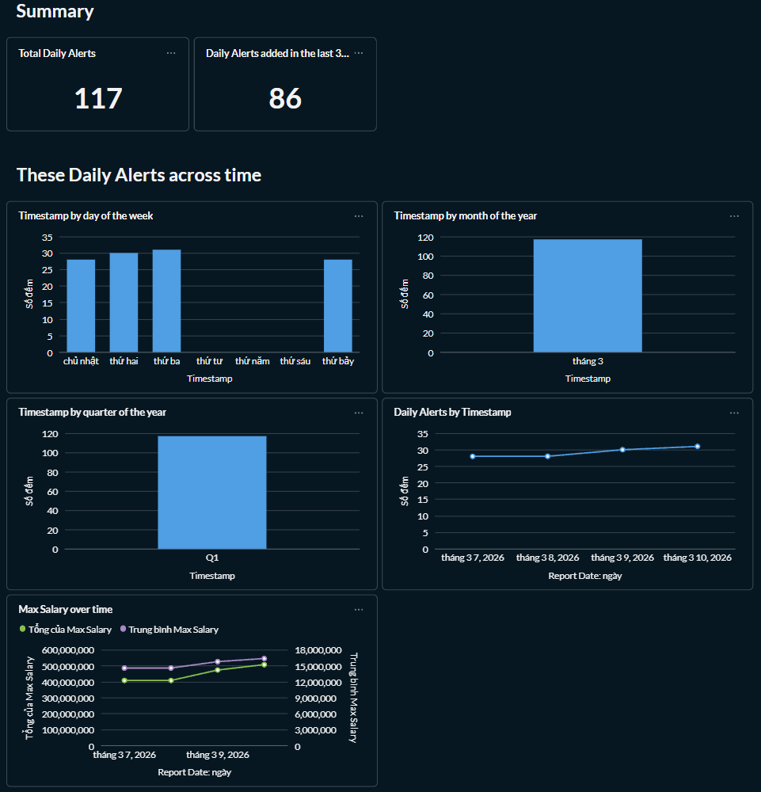

# Data Lakehouse: Vietnam IT Job Market


## 📌 Introduction
This is an End-to-End Data Engineering portfolio project. It automatically scrapes IT job listings in Vietnam (ITviec, TopCV), processes the data through a Medallion Architecture (Bronze -> Silver -> Gold) using Apache Spark and Apache Iceberg, and visualizes market insights. The pipeline also includes a Discord Bot for real-time high-salary job alerts.

## 🏗️ Architecture & Data Flow

1. **Ingestion (Crawlers):** Python bots (using `camoufox`/`curl_cffi` to bypass Cloudflare) scrape job data daily and upload raw JSON files to MinIO.
2. **Data Lakehouse (Medallion Architecture):**
   - **Bronze Layer (Raw):** Stores raw JSON data in MinIO. Great Expectations validates and filters dirty records to quarantine.
   - **Silver Layer (Transform):** PySpark flattens nested JSON, standardizes salary, location, deduplicates.
   - **Gold Layer (Aggregated):** PySpark aggregates summary, salary alerts, ITviec job listings for serving.
3. **Query Engine:** **Trino** connects to the Iceberg tables (via Hive Metastore) to provide high-performance SQL querying over the data lake.
4. **Orchestration:** **Apache Airflow** schedules and monitors the entire pipeline.
5. **Serving / Notification:** - A **Discord Bot** queries Trino directly to push daily market reports and VIP job alerts to users.
   - **Metabase** is connected to Trino for building visual dashboards.

## 🎯 Technical Objective
* **Architecture:** Designed and deployed a complete, scalable, end-to-end Data Lakehouse system from scratch.
* **Data Processing:** Implemented the Medallion Architecture (Bronze - Silver - Gold) using Apache Spark to clean, standardize, and aggregate data efficiently.
* **Data Quality:** Integrated Great Expectations to ensure data integrity, automatically filtering and quarantining invalid or corrupted records at the ingestion stage.
* **Orchestration & serving:** Automated and scheduled the daily data pipeline using Apache Airflow, and utilized Trino as a high-performance query engine for fast data retrieval.

## 🛠️ Tech Stack
* **Languages:** Python, SQL
* **Data Processing:** Apache Spark (PySpark)
* **Data Quality:** Great Expectations
* **Storage & Table Format:** MinIO (S3 API), Apache Iceberg
* **Catalog:** Hive Metastore, PostgreSQL
* **Query Engine:** Trino
* **Orchestration:** Apache Airflow
* **Infrastructure:** Docker, Docker Compose
* **Notification/BI:** Discord API, Metabase

## 🚀 How to Run Locally

### 1. Prerequisites
* Docker and Docker Compose installed.
* At least 8GB of RAM allocated to Docker.

### 2. Setup Environment Variables
Create a `.env` file in the root directory and add your secret keys (DO NOT commit this file):
```env
DISCORD_TOKEN=your_discord_bot_token
DISCORD_WEBHOOK_URL=your_discord_webhook_url
POSTGRES_DB = your_postgres_db
POSTGRES_USER=your_postgres_db
POSTGRES_PASSWORD=your_postgres_db
MINIO_ROOT_USER= your_minio_user
MINIO_ROOT_PASSWORD= your_minio_password
MB_DB_USER= your_MB_DB_USER
MB_DB_PASS= your_MB_DB_PASS
```

Create a 'hive-site.xml' file to store configuration settings:
```xml
<?xml version="1.0"?>
<configuration>
    <property>
        <name>javax.jdo.option.ConnectionDriverName</name>
        <value>org.postgresql.Driver</value>
    </property>
   ... your_property
</configuration>
```

### 3. Start Services
docker-compose up -d

### 4. Trigger Pipeline
Click Airflow UI: http://locahost:8080
Enable DAG: job_hunter_pipline

## 🤖 Discord bot jobs post



## Dags of jobs


## Metabase Jobs DashBoard




⚠️This project is for educational purposes only and is intended to showcase my skills on my CV.

## 🤝 Let's Connect!

This project is a significant milestone in my journey as a **Data Engineer**. Building this End-to-End Lakehouse from scratch has solidified my skills in distributed processing, data orchestration, and system architecture.

I am currently open to **Fresher Data Engineer** opportunities. If you find this project interesting, have any feedback, or want to discuss data architectures, I would love to connect with you!

* 💼 **LinkedIn:** [(https://www.linkedin.com/in/duc-thinh-pham-8705b0249/)]
* 📧 **Email:** [thinhpham1807@gmail.com]